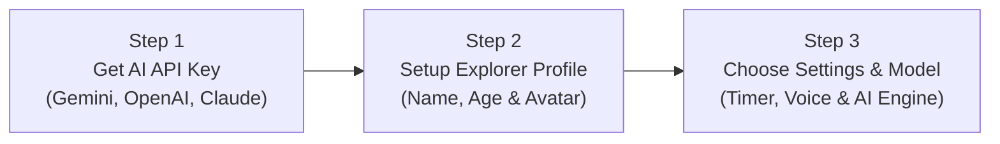
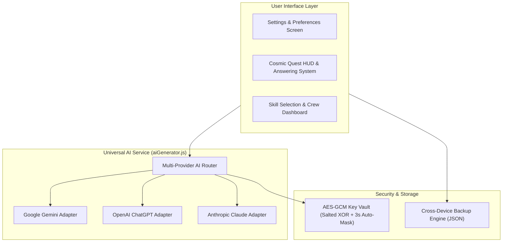

# 🚀 AstroQuest - 100% Live AI-Powered Cosmic Learning for Early Explorers

<p>
  <a href="README.md"></a>
  <a href="CONTRIBUTING.md"></a>
  <a href="RELEASE_NOTES.md"></a>
  <a href="documentation/AstroQuest_Implementation_Documentation.md"></a>
</p>

An engaging, visual-first React.js educational platform designed for early childhood and young learners (Ages 2–14), featuring cosmic space-themed AstroQuest challenges, interactive animations, sound effects, on-demand voice narration, **Multi-Provider AI generation (Google Gemini, OpenAI ChatGPT, and Anthropic Claude)**, an **Interactive Socratic AI Doubt Tutor**, **Hands-free Speech-to-Answer Voice Input**, **Tactile Manipulatives (Balance Scales, Analog Clocks, 3D Rotatable Blocks)**, **Galaxy Odyssey Solar System Map**, **Educator Analytics Portal**, **Print-and-Play Cosmic Worksheets**, **Offline Quest Vault**, and an **Installable Progressive Web App (PWA)** with automated unit testing.

---

<details>
<summary><h2 style="display: inline;">🚀 User Quick Start Guide</h2></summary>

### 🧑‍🚀 Quick Setup in 3 Easy Steps



#### Step 1: Obtain an AI API Key

- **✨ Google Gemini (Recommended Free Tier)**: Visit [Google AI Studio](https://aistudio.google.com/app/apikey) and click **"Create API Key"**. No credit card required!
- **🟢 OpenAI (ChatGPT)**: Visit [OpenAI Platform API Keys](https://platform.openai.com/api-keys) to generate an API key (`sk-...`).
- **🎭 Anthropic (Claude)**: Visit [Anthropic Console](https://console.anthropic.com/settings/keys) to generate an API key (`sk-ant-...`).

#### Step 2: Configure Explorer Profile

1. Launch AstroQuest in your browser.
2. Click **"Settings ⚙️"** in the top-right corner.
3. Enter your **Child's Name** and **Age** (Ages 2–14). The pedagogy automatically calibrates to their cognitive level!
4. Pick an **Astronaut Avatar** (Boy, Girl, Robot, or Alien).

#### Step 3: Select AI Provider & Save Key

1. Under **"Select AI Intelligence Provider"**, click your preferred provider (**Google Gemini**, **OpenAI**, or **Anthropic Claude**).
2. Paste your API key into the secure vault and pick your preferred AI model.
3. Click **"Save & Launch 🚀"**. The app runs an instant live verification ping.

> 📘 For the complete detailed guide on managing multi-child flight crews, custom skillset synthesis, audio focus tools, and open-source contribution guidelines, visit the [**User Guide & Contributing Hub (CONTRIBUTING.md)**](CONTRIBUTING.md).

</details>

---

<details>
<summary><h2 style="display: inline;">📘 Technical Architecture & System Specs</h2></summary>



- **Universal Multi-Provider Architecture**: Direct client-side calls to Google Gemini, OpenAI (`v1/chat/completions`), and Anthropic (`v1/messages` with direct browser access header).
- **Security & Privacy First**: Zero third-party tracking, client-side AES-GCM encrypted key storage, 3-second auto-masking, DOM vault inspection defense, and cut/copy prevention.
- **Cognitive Science & Pedagogy**: Strict 4-tier age calibration (Ages 2–14) with dynamic SVG math diagrams and instant voice feedback.
- **Detailed Blueprint**: See the full architectural specification at [**AstroQuest_Implementation_Documentation.md**](documentation/AstroQuest_Implementation_Documentation.md).

</details>

---

<details open>
<summary><h2 style="display: inline;">✨ Key Features & Architecture</h2></summary>

<details>
<summary><h3 style="display: inline;">1. ⚙️ Dedicated Full-Screen Settings & Preferences Page</h3></summary>

- **Full-Page Configuration Experience**: Replaced popup modals with a dedicated full-screen configuration interface:
  1. **Child's Name** _(Required)_: Personalized explorer name.
  2. **Child's Age** _(Required & Strictly Clamped 2–14)_: Quick age selector pills (`3`–`8`) + custom stepper and direct numeric input strictly restricted between ages `2` and `14` (non-digits and invalid characters blocked, live clamping to 14, and onBlur bounds enforcement).
  3. **Multi-Provider AI Intelligence Selector (Google Gemini, OpenAI ChatGPT, Anthropic Claude 🤖)**:
     - **Select Your Preferred AI**: Choose between Google Gemini (Free Tier Available), OpenAI ChatGPT (High Intelligence), or Anthropic Claude (Fast & Precise).
     - **Individual Encrypted API Key Storage**: Seamlessly enter and securely store API keys for each provider independently. Switching providers dynamically updates model catalogs, portal links, and placeholders without wiping credentials.
  4. **Active Provider API Key** _(Mandatory 🔑 with Live Validation & Vault Security)_:
     - **Encrypted Value Display in Field**: The field strictly renders the salted encrypted vault ciphertext (`enc:v1:vault:...`) rather than exposed plaintext credentials, completely preventing DOM inspection and scraping of the raw key.
     - **3-Second Auto-Masking Window**: When a new or existing key is pasted or entered, the text is temporarily revealed for 3 seconds so the user can verify their input, after which it automatically masks into a password field (`••••••••`). The eye icon toggle has been removed to permanently prevent snooping.
     - **Copy & Cut Prevention with Tooltip Notification**: Copying or cutting from the API key input is strictly disallowed (`Ctrl+C`, `Cmd+C`, `Ctrl+X`, `Cmd+X`, and context menus are intercepted). When attempted, an alert notification badge displays: _"Copy functionality is not allowed for this field"_.
     - **On-the-Fly Transparent Decryption**: While the input field and local storage remain securely encrypted, the app transparently decrypts the key on-demand when dispatching network calls (live validation, dynamic model fetching, and real-time quiz synthesis). Direct links to obtain keys (Google AI Studio, OpenAI Platform, Anthropic Console) are provided.
  5. **Curated & Live AI Model Engine Selection**:
     - **Google Gemini**: Auto-downloads and caches frontier models (`gemini-2.5-flash`, `gemini-2.5-pro`, etc.) with one-click manual refresh (`Fetch Latest 🔄`).
     - **OpenAI (ChatGPT)**: Curated high-performance models including `gpt-4o-mini`, `gpt-4o`, `o3-mini`, and `o1-mini`.
     - **Anthropic (Claude)**: Curated frontier models including `claude-3-5-haiku-20241022`, `claude-3-5-sonnet-20241022`, and `claude-3-opus-20240229`.
  6. **Per-Question Time Limit & Unlimited Stopwatch Mode** _(Optional ⏱️)_:
     - **Countdown Mode**: Toggle ON to select preset per-question countdowns (`45s`, `60s`, `90s`, `2m`, `3m`) or a custom duration (`15s`–`300s`).
     - **Unlimited Stopwatch Mode**: When disabled, elapsed session time is counted upward in a pausable stopwatch widget. Clicking either the Header timer badge or bottom bar timer toggles pause, and the timer **automatically resumes immediately whenever the student interacts with the question** (touches question card, selects an option, requests hints, or presses keyboard shortcuts).
  7. **Next Question Auto-Advance Delay** _(Optional ⏩)_: Toggle Auto-Advance ON/OFF, select preset delay (`3s`, `5s`, `7s Default`, `10s`, `15s`), or set a custom delay (`2s`–`30s`).
  8. **Visual Diagrams & Clues Display** _(Optional 👁️ - Disabled by Default)_: Toggle ON/OFF (`🙈 Hidden Default` / `👁️ Shown`) to choose whether interactive geometric diagrams, 3x3 matrices, sequence patterns, and STEM illustrations appear alongside questions **and** inside answer option cards. When disabled, option cards cleanly hide all shape containers and render full-width text choices.
  9. **Dynamic Visual Synthesis Notice**: Displays an informative amber alert in Settings explaining that visual diagrams and option shapes are dynamically generated via cognitive models and AI prompts, so minor visual variations may occasionally occur.
  10. **Narrator Voice Selector** _(Customizable 🎙️)_: Choose from all text-to-speech voices supported by your web browser and operating system, with an **"Auto (Recommended)"** default option and instant one-click audition audio playback before saving.
  11. **Clean, Unobstructed Question Focus (Pet Assistant Removed)**: Streamlined learning experience ensuring young explorers maintain 100% focused attention on question prompts, cognitive patterns, and answer choices with zero floating visual distractions.
  12. **Cross-Device Backup & Portability Engine (`Export JSON 📤` / `Import JSON 📥`)**:
      - **Complete Configuration Bundling**: Export your entire setup into a portable JSON backup file (`astroquest_complete_backup_YYYY-MM-DD.json`), including child's name, age, active AI provider, provider API keys, model selections, question timer settings, auto-advance delay, visual diagrams toggle, voice selection, and all custom skillsets.
      - **Seamless Multi-Computer Migration**: Transfer your child's learning profile and custom-built topics to any other laptop, classroom computer, or browser with one click.
      - **Zero-Refresh Reactive Hydration**: Importing instantly populates all form fields, updates application state, and syncs `localStorage` without requiring a page reload.

- **Live Verification on Save**: When clicking **"Save & Launch 🚀"**, the app sends an asynchronous test ping to the active AI provider (Google Gemini, OpenAI, or Anthropic). If the key is invalid or expired, a clear red error is shown and the settings page remains open until a valid key is provided.
- **Settings Dirty-State Guard & Save Confirmation Before Navigation**:
  - Automatically tracks whether any setting (explorer name, age, API key, model selection, timer challenge, auto-advance delay, voice, or visual diagram preference) has been modified.
  - If a user changes settings and attempts to navigate away without clicking **"Save Settings"**, an interactive confirmation dialog alerts the user:
    - **"Save & Continue"**: Validates and saves changes immediately before navigating.
    - **"Discard Changes"**: Reverts all settings back to their previously saved values, ensuring unconfirmed edits never bleed into the active session.
- **Skill Selection Auto-Launch Flow**: If a user clicks a skill card without having entered an API key, the app transitions directly to the Settings page while remembering the targeted skill. Upon successful validation, it immediately launches the selected skill quest.

</details>

---

<details>
<summary><h3 style="display: inline;">2. ⚡ 100% Direct Live Generation (Zero In-Memory Caching)</h3></summary>

- **Fresh Generation on Every Request**: Questions are never cached into memory; every time a child starts a new sheet or advances to the next sheet, fresh questions are synthesized live from the Google Gemini API.
- **Skillset-Injected AI Prompts**:
  - The AI prompt explicitly injects the **Selected Skillset Name**, **Detailed Pedagogical Description**, and **Core Learning Objective**:
    - **Visual**: _Visual observation, recognizing geometric & color pattern progressions (AB, AAB, ABC), spatial rotations, object counting, missing grid tiles, isometric 3D block projections, and balance scale weight logic._
    - **Analytical Thinking**: _Logical deduction, relational analogies (A : B :: C : D), everyday cause-and-effect science & nature riddles, categorical classification (odd-one-out), deductive logic riddles, and multi-step critical thinking._
  - Questions in Batch 1 (Q1–Q5) and Batch 2 (Q6–Q10) are assigned distinct sub-topic domains to guarantee high cognitive variety.
- **Strict Non-Repetition & Guaranteed 10-Question Delivery**:
  - Normalized string matching (`normalizeText`) ensures all 10 questions in a thinksheet are 100% distinct with zero duplicates in concept, wording, or numbers.
  - **Guaranteed 10 Questions (Zero Shortfalls)**:
    - Initial batches request 6 questions per batch (12 total) to provide a resilient buffer against API dropouts.
    - If deduplication or formatting causes the count to be 8 or 9, an automated top-up pass immediately fetches the missing questions.
    - An emergency fill pool guarantees that every thinksheet session delivers **strictly 10 questions**, 100% of the time.
  - Seen question signatures are tracked in browser storage across consecutive sessions to prevent repetition.
- **Skip Question Option (`SkipForward ⏭️`)**:
  - Allows students to skip challenging or unfamiliar questions directly from the question screen.
  - Skipped questions are marked with an amber indicator in the top progress bar and recorded in the Question Summary and Result Overview (`{correctCount} Correct • {skippedCount} Skipped`).

</details>

---

<details>
<summary><h3 style="display: inline;">2.1. 🛸 Immersive Space-Themed Cosmic Quest Loader (`CosmicQuestLoader.jsx`)</h3></summary>

- **Dynamic Space Mission Theater**:
  - Replaced generic loading spinners with a custom, application-connected space theater that engages young explorers while the Gemini AI synthesizes questions.
  - **Central Celestial AI Planet**: High-resolution cosmic sphere with atmospheric shading, glowing nebula aura, and Saturn-like tilted planetary ring (`rotate(-25deg)`).
  - **Orbiting Vector Space Rocket**: Multi-polygon futuristic rocket orbiting along an elliptical 360° flight trajectory with animated stardust trails (`astroOrbitDust`) and a flickering plasma engine thruster plume (`thrusterFlame`).
  - **Radar Pulses & Warp Gauge**: Dual pulsing radar rings and a sci-fi energy bar with animated gradient warp beam highlights.
- **Dynamic Child Profile & Age Binding**:
  - Automatically reads the explorer's name and age from active settings and persistent storage (`getStoredKidName()`, `getStoredKidAge()`), completely personalizing the loading experience:
    - `"Plotting Flight Coordinates for {Name}..."`
    - `"AI Neural Core Synthesizing Age {Age} Puzzles..."`
    - `"Synthesizing 10 brand-new puzzles for {Name} (Age {Age})..."`
    - Telemetry footer: `LEVEL: AGE {Age}` • `🟢 {NAME}'S LINK ONLINE`.
- **Adaptive Skillset Extraction & Dynamic Theming**:
  - Dynamically extracts the active skillset name from session props and `localStorage` (`thinksheet_selected_skill_v1`):
    - **Visual Skillset**: Cyan and deep navy planetary gradient (`from-[#00E5FF] via-[#0284C7] to-[#0F172A]`), glowing `<Eye />` core icon, cyan ring, `👁️` orbiting stardust, and telemetry calibrating observation & visual patterns.
    - **Analytical Thinking Skillset**: Purple and indigo planetary gradient (`from-[#A855F7] via-[#6366F1] to-[#1E1B4B]`), glowing `<Brain />` core icon, purple ring, `🧩` orbiting stardust, and telemetry calibrating analytical deduction & logic relationships.
    - **Custom User-Created Skillsets**: Automatically adapts to custom emojis, titles, and tailored cosmic mission telemetry cues (e.g. `"Scanning Deep Space for Science & Space Exploration Challenges... 🚀"`).

</details>

---

<details>
<summary><h3 style="display: inline;">2.2. 🛠️ User-Defined Custom Skillset Creation & File / LocalStorage Persistence</h3></summary>

- **Unlimited Custom Learning Domains**:
  - AstroQuest breaks free from static 2-skill constraints by allowing educators, parents, and students to create an unlimited number of custom skillsets directly from the dashboard.
- **Direct Gemini AI Prompt Calibration**:
  - The custom skillset name, tagline, and detailed pedagogical description are sent directly in Google Gemini's live API prompts.
  - The AI synthesizes questions, hints, explanations, and diagram types precisely aligned with the user-defined topic (e.g., _"Planets, gravity, constellations, and astronaut equipment"_ for a Space Exploration skill).
- **Personalized Visual Identity**:
  - **Emoji Icon Picker**: Choose from popular educational emojis (🚀, 🪐, 🔬, 📐, 🌿, ⭐, 🧩, 🎨, 📚, 🐾, 🎯, 🔢, 🦖, 🤖) or input any custom character.
  - **Color Accent Themes**: Select between 6 cosmic palettes (`Cosmic Cyan`, `Nebula Purple`, `Emerald Aurora`, `Solar Amber`, `Supernova Rose`, `Deep Orbit Blue`).
- **Dynamic Non-Repeating Random Skillset Generator (`Surprise Me 🎲`)**:
  - **One-Click Instant Topic Discovery**: Click the dedicated purple gradient **`Surprise Me 🎲`** button in the modal banner or inline beside the _Skillset Name_ field to instantly generate an exciting, age-calibrated exploration topic.
  - **Strict Non-Repetition Memory**: Tracks recently suggested topics in session memory and injects negative prompt constraints into AI synthesis, guaranteeing that consecutive clicks provide completely fresh, non-repeating topics.
  - **Curated Offline Catalog (30+ Themes)**: Includes an offline catalog spanning deep-sea mysteries, kitchen chemistry, dinosaur fossils, spy cryptography, origami geometry, rainforest canopy ecology, and space rovers, guaranteeing immediate suggestions even when offline or without an API key.
- **Cross-Device Migration & Dual Persistence Architecture (`backupManager.js`)**:
  - **Persistent LocalStorage**: Stored under `astroquest_custom_skillsets_v1` so custom skillsets appear on the home page automatically whenever returning.
  - **Complete Backup Export (`Export JSON 📤`)**: Available on both Settings and Dashboard screens. Generates a timestamped JSON file containing all custom skillsets and explorer configuration (profile, encrypted API key, model, timer, auto-advance, voice, visual diagrams) for effortless migration across computers.
  - **Instant Schema Validation & Import (`Import JSON 📥`)**: Safely imports settings and custom skillsets, validating payloads and immediately hydrating active state across the entire UI with zero page reload required.
  - **Dual-Payload Schema Parser**: Automatically recognizes and imports both complete system backups (`{ settings, skillsets }`) and legacy skillset-only JSON files (`[ ... ]`).
- **Protected Defaults & Safe Management**:
  - Built-in default skills ("Visual" and "Analytical Thinking") are protected and cannot be deleted.
  - Custom skills feature a dedicated delete action with an interactive confirmation modal to prevent accidental loss.

</details>

---

<details>
<summary><h3 style="display: inline;">3. 🤖 Active Google Gemini Models Support & Resilient Multi-Model Fallback</h3></summary>

- **Active Model Chain**:
  1. `gemini-3.5-flash-lite` _(Primary, ultra-fast endpoint recommended by Google)_
  2. `gemini-3.5-flash`
  3. `gemini-3-flash-preview`
  4. `gemini-2.5-flash`
- **Automatic Background Download & Persistent Local Caching**:
  - **Zero Setup Friction**: On initial loading of the Settings screen, AstroQuest automatically downloads all latest available models using the active API key.
  - **Persistent Local Caching**: Model records and capabilities are saved to `thinksheet_dynamic_gemini_models_v1` in `localStorage`. Subsequent openings of the Settings page read directly from cache with **zero repeat network requests**, saving time and bandwidth.
  - **Latest-Model Default Selection**: The downloaded models are evaluated and sorted using an intelligent ranking algorithm (`getModelScore`). The latest model (e.g. `gemini-3.5-flash-lite`) is automatically identified, badged with `Latest Default`, and pre-selected.
- **On-Demand Google Gemini Model Refresh (`Fetch Latest Models 🔄`)**:
  - In Settings, users can click **Fetch Latest Models 🔄** at any time to force-refresh the cache from Google's live `models.list` API.
  - Newly discovered frontier and experimental models can be chosen immediately without requiring code updates.
- **Automatic JSON Sanitizer & Repair**: Automatically cleans parenthesized tuple-style syntax, Python constants (`True`/`False`/`None`), and trailing commas from LLM output.

#### 🧠 Strict 4-Tier Age-Calibrated Pedagogy (Ages 2 to 14)

The AI dynamically adapts prompt personas, vocabulary, and cognitive complexity based on the child's exact age:

| Age Tier                              | Cognitive Level                     | Visual Skill Examples                                                                            | Analytical Thinking Examples                                                                                  |
| :------------------------------------ | :---------------------------------- | :----------------------------------------------------------------------------------------------- | :------------------------------------------------------------------------------------------------------------ |
| **Ages 2–4** (Preschool)              | Foundational recognition & counting | Counting 1–5 objects (apples 🍎, stars ⭐), simple AB color patterns (🔴 🔵 🔴 🔵)               | Parent/baby animals (_Puppy : Dog :: Kitten : Cat_), animal sounds & basic colors                             |
| **Ages 5–7** (Early Elementary)       | Early reasoning & arithmetic        | Counting 4–12 items, AAB / ABC patterns, grid tile gaps, balance scales                          | Functional analogies (_Bird : Nest :: Bee : Hive_), everyday cause-and-effect (_Ice in sun -> melts_)         |
| **Ages 8–10** (Upper Elementary)      | Multi-step logic & STEM deduction   | Number sequences (`3, 6, 12, 24, ?`), 3D block projections, grid area matrices                   | Higher-order analogies (_Author : Book :: Sculptor : Statue_), scientific states of matter                    |
| **Ages 11–14** (Middle School / Teen) | Advanced analytical problem-solving | Algebraic & non-linear sequences (`2, 5, 10, 17, 26, ?`), rotational symmetry, isometric volumes | Abstract analogies (_Microscope : Cell :: Telescope : Galaxy_), deductive syllogisms, physics & circuit logic |

</details>

---

<details>
<summary><h3 style="display: inline;">4. 🎨 Dynamic SVG Shape Generator & Rich Visual Diagram System</h3></summary>

- **Mathematical Geometric Shape Engine (`shapeGenerator.jsx`)**:
  - **Dynamic Polygon Coordinate Math (`getRegularPolygonPoints`)**: Calculates vertex angles and Cartesian points for any regular polygon ($N \ge 3$):
    - `Triangle` (3 sides), `Square` (4 sides), `Pentagon` (5 sides), `Hexagon` (6 sides), `Heptagon` (7 sides), `Octagon` (8 sides), `Nonagon` (9 sides), `Decagon` (10 sides), `Circle` (0 sides), `Star`, `Moon` (crescent), `Sun` (sunburst), `Heart`, `Diamond`.
  - **Comprehensive Emoji & Symbol Parser (`parseDynamicShape`)**:
    - Extensively recognizes Unicode geometric and celestial emojis:
      - 🌙 Crescent moons (`🌙`, `🌛`, `🌜`, `🌔`, `🌖`, `🌘`, `🌒`) ➔ Parsed as `{ shape: 'moon', color: 'Gold' }`.
      - ⭐ Stars (`⭐`, `🌟`, `✨`, `★`, `☆`) ➔ Parsed as `{ shape: 'star', color: 'Gold' }`.
      - ☀️ Sunbursts (`☀️`, `🌞`, `🌅`) ➔ Parsed as `{ shape: 'sun', color: 'Gold' }`.
      - ❤️ Hearts (`❤️`, `💙`, `💚`, `💛`, `💜`, `🧡`) ➔ Parsed as `{ shape: 'heart', color: 'Red/Colored' }`.
      - 🔷 Diamonds (`🔷`, `🔹`, `🔶`, `🔸`, `◆`, `◇`).
      - 🔴 Circles (`🔴`, `🔵`, `🟡`, `🟢`, `🟣`, `🟠`, `🟤`, `⚫`, `⚪`).
      - 🟩 Squares (`🟩`, `🟥`, `🟦`, `🟨`, `🟪`, `🟧`, `🟫`, `⬛`, `⬜`).
  - **Vector SVG Crescent Moon Path**:
    - Implemented a smooth cubic Bezier vector crescent moon curve in `DynamicSvgShape`, eliminating jagged pixelated emojis and scaling cleanly in all screen resolutions.
    - Protected 0-sided shapes (`moon`, `sun`, `heart`) from being shadowed or overridden by general circle checks.
  - **Color & Shading Styles**:
    - **White / Outline**: Clean `#FFFFFF` fill with high-contrast `#0F172A` borders.
    - **Solid / Filled**: Vibrant solid fills (e.g. Amber/Gold `#F59E0B` for sun, moon, and star, Crimson Red `#EF4444` for heart, Royal Blue `#3B82F6` for shapes).
    - **Striped / Hatching**: Crisp SVG vector diagonal hatch pattern (`<pattern id="...-striped">`).
    - **Dotted / Polka**: Crisp SVG vector dot pattern (`<pattern id="...-dotted">`).
    - **Vibrant Colors**: _Blue_, _Green_, _Red_, _Cyan_, _Yellow_, _Orange_, _Purple_, _Pink_, _Gold_.
  - **3x3 Matrix Grid Automatic Parsing (`parseMatrixGridFromQuestion`)**:
    - Automatically extracts matrix cells from questions describing Row 1, Row 2, and Row 3 (e.g. _Row 1 has a solid star, striped moon, and dotted sun_).
    - Pairs every cell with the exact shape (`Star`, `Moon`, `Sun`, etc.) and pattern (`Solid`, `Striped`, `Dotted`).
    - In Question mode: The unknown tile renders a purple dashed cell with `❓`.
    - In Solution mode: The target tile displays the correct answer tile highlighted in emerald green.
  - **Clean & Deduplicated Visual Cards (`DynamicShapeCard`)**:
    - Renders the exact geometric shape cleanly on a pedestal with a deduplicated style tag (e.g. `Gold Star`, `Gold Moon`, `Dotted Sun`).
    - Prevents duplicate emoji output by ensuring the visual representation and text label never redundantly print identical emojis.

- **Dynamic SVG Shapes & Concept Icons in Answer Option Cards (`OptionsGrid.jsx`)**:
  - Each answer option card (A, B, C, D) renders the exact mathematical SVG shape or concept visual icon alongside the answer text.
  - **Automatic Contrast Pedestals**:
    - **White Shapes on White Cards**: Placed inside a soft slate contrast pedestal (`bg-slate-100 border border-slate-300`) so white/outline shapes are 100% visible against white card backgrounds.
    - **Selected Option Highlight**: Selected cards switch the shape container to a crisp white pedestal (`bg-white/95 border-2 border-white shadow-md`) providing maximum contrast against the selected orange gradient.
    - **Shaded / Hatched Shapes**: Rendered with SVG diagonal hatch patterns with clear outlines.
  - **Distinct Selection Spacing & Outer Ring**:
    - Option grid spaced with generous padding (`gap-3.5 sm:gap-4.5 p-1`).
    - The selected answer card receives a dark offset outer ring (`ring-4 ring-orange-400/80 ring-offset-2 ring-offset-[#0d1033] shadow-2xl scale-[1.02]`), making the active selection immediately clear against adjacent options.
- **Intelligent Concept Visual Mapping (`getConceptVisual`)**:
  - Automatically pairs educational and STEM concepts with large, colorful graphic badges (e.g. _Photosynthesis_ ➔ `☀️🍃`, _Plant_ ➔ `🌱`, _Cellular Respiration_ ➔ `⚡🫁`, _Animal_ ➔ `🐾`, _Microscope_ ➔ `🔬`, _Galaxy_ ➔ `🌌`, _Author_ ➔ `📖`, _Architect_ ➔ `📐`, _Statue_ ➔ `🗿`, etc.).
- **Spatial Geometry: Shape Rotation & 90° Quadrant Turns (`shape-rotation`)**:
  - Automatically activates for questions on 2D shape rotation, angular turns ($90^\circ$, $180^\circ$, $270^\circ$, $45^\circ$), and clockwise/counter-clockwise shifts.
  - Draws 4-quadrant squares with physical SVG rotation and shaded active quadrants.
  - Connects each step with circular directional arrows (`⟳ RotateCw` / `⟲ RotateCcw`) and turn magnitude badges (`+90° CW` / `+90° CCW`).
  - Answer option cards render the exact 4-quadrant square corresponding to each position (Top-Left, Top-Right, Bottom-Left, Bottom-Right).
- **Physics & Optics: Light Dispersion Prism Diagram (`optics-prism`)**:
  - Automatically activates for questions on light, prisms, refraction, dispersion, and rainbows.
  - Draws a crystalline glass prism with an incident white light beam entering, bending inside the glass medium, and emerging as a vibrant 7-band rainbow spectrum (Red, Orange, Yellow, Green, Cyan, Blue, Violet).
  - Includes a step-by-step physics breakdown (`Incident Ray` ➔ `Light Bends (Refraction)` ➔ `Rainbow Colors Split`) and solution confirmation.
- **Rich Relational Analogy Boards (`analogy-map`)**:
  - Activated strictly for genuine 4-term analogies (`A : B :: C : D`), eliminating generic dummy placeholder fallbacks.
- **Cause & Effect Flow (`cause-effect`)**:
  - Process chains visualizing scientific actions, experiments, and resulting phenomena.
- **Growing Shape Count Progressions & Triangular Clusters (`shape-pattern-grid`)**:
  - Automatically parses multi-step shape count progressions (e.g. Step 1 has 1 square, Step 2 has 3 squares, Step 3 has 6 squares, Step 4 has 10 squares).
  - Renders true visual clusters of $N$ geometric shapes (e.g. 1 square, a triangular cluster of 3 squares, a triangular cluster of 6 squares, a triangular cluster of 10 squares) rather than a single shape.
  - Step 6 target card (`❓ Step 6: How many?`) reveals 21 shaded squares in Solution mode with step and count badges.
- **Sequence Ladders (`sequence-ladder`)**: Number lines and progression steps with interval rules.
- **3D Isometric Block Pyramids & Cube Towers (`block-tower` / `isometric-tower`)**:
  - Automatically parses layer dimensions from question text (e.g. $3\times3$ base with 9 cubes, $2\times2$ middle with 4 cubes, $1\times1$ top with 1 cube = 14 unit cubes).
  - Renders genuine 3D isometric cubes with light, medium, and dark shaded faces, depth-sorted from back-to-front.
  - Displays individual layer volume breakdown badges and total volume calculation in solution mode.
- **3x3 Matrix Grid Shape Progression (`matrix-grid`)**: Full $3\times3$ geometric matrix with dynamic SVG shapes and missing target solution reveals.
- **Object Counting (`apple-counting`)**: High-contrast, friendly countable item arrays.
- **Scale Balance (`scale-balance`)**: Physics lever scales showing heavier/lighter weights.
- **On-Demand AI Image Request Pipeline & Automatic Free API Failover (`generateAiVisualImage`)**:
  - **Multi-Provider AI Image Engine**: Supports an automated failover chain across multiple image generation endpoints:
    1. `Google Imagen 3` (`imagen-3.0-generate-002:predict`)
    2. `Gemini 2.5 Flash Native Image` (`gemini-2.5-flash-image:generateContent`)
    3. `Pollinations AI Flux` (Free, keyless high-fidelity diffusion generator)
    4. `Pollinations AI Turbo` (Free, keyless high-speed generator)
  - **Automatic `RESOURCE_EXHAUSTED` / Quota Failover**:
    - When any provider returns `RESOURCE_EXHAUSTED`, HTTP 429, or quota limits, the engine automatically catches the error and switches to the next free API image generator without disrupting the user.
  - **Persistent Provider Retention**:
    - Once switched to a working free API, that provider is persisted in browser storage (`localStorage`) and kept active for all subsequent image generations. If that provider ever reaches quota limits, it seamlessly transitions to the next free generator in the sequence.
  - **Kid-Friendly Vector Prompting**: Formulates focused educational prompts tailored for early learners on crisp white backgrounds.
  - **Cosmic Shimmer Status Badge**: Displays an animated `✨ Generating AI Visual Illustration...` badge during synthesis.
  - **In-Memory Image Caching**: Caches generated base64 image URIs in an in-memory session map to prevent duplicate API requests.
  - **Zero-Disruption Fallback**: If an image request times out or all providers are unavailable, the card automatically falls back to procedural SVG diagrams so the learner's quest is never delayed or broken.
- **Lazy Image Loading (`loading="lazy"`)**:
  - Direct image diagrams load asynchronously using native browser lazy loading (`loading="lazy"` and `decoding="async"`).
  - Features an animated skeleton shimmer placeholder and smooth fade-in transitions on load for optimal rendering performance and zero layout shift.

</details>

---

<details>
<summary><h3 style="display: inline;">5. ⏩ Configurable Next Question Auto-Advance Pacing</h3></summary>

- **Independent Learning Pace Control**: Works whether the per-question timer challenge is enabled or disabled:
  - **When Auto-Advance is Enabled (Default `7s`)**:
    - After an answer is submitted or time expires, the solution is displayed for the configured delay duration with a real-time countdown badge (`Next in 7s... 6s... 5s...`).
    - Automatically advances to the next question when the countdown reaches zero.
    - Includes an immediate `Next (7s) ➔` button to skip waiting anytime.
  - **When Auto-Advance is Disabled (Manual Next Mode)**:
    - The solution and visual diagram remain on screen indefinitely.
    - The student or parent clicks the `Next Question ➔` button when ready to proceed.

</details>

---

<details>
<summary><h3 style="display: inline;">6. 📐 Symmetrical Layout, Skip Option & Sticky Bottom Submit / Next Buttons</h3></summary>

- **Equal-Height Cards**: The left Question Card and right Options Section share identical vertical heights (`items-stretch` & `h-full`), keeping prompts and visual diagrams neatly centered.
- **Expanding Options Grid**: Option buttons dynamically expand (`flex-1 h-full`) to fill available vertical space.
- **Sticky Bottom Action Bar & Next Button**:
  - Both the active Submit action bar (containing Hint, Skip, and Submit) and the SolutionPanel Next button are positioned with `sticky bottom-0 sm:bottom-2 z-30` paired with a translucent cosmic backdrop blur (`bg-[#0C1033]/95 backdrop-blur-md`).
  - When options content or solution cards cause vertical scrolling or overflow, the buttons remain docked at the bottom of the viewport so students never need to scroll down to submit an answer or advance.
- **Real-Time Countdown on Submit**: When the timer challenge is active, the Submit button displays the remaining countdown badge (e.g. `Submit ⏱️ 01:30`) with animated color urgency alerts:
  - **Normal (> 15s)**: Dark translucent pill (`bg-black/30 text-white/90`).
  - **Warning (<= 15s)**: Pulsating amber alert (`bg-amber-950/80 text-amber-300`).
  - **Critical (<= 5s)**: Bouncing red urgent indicator (`bg-rose-950 text-rose-300`).

</details>

---

<details>
<summary><h3 style="display: inline;">7. 🚪 Streamlined Exit Confirmation Workflow</h3></summary>

- **Distraction-Free Top Bar**: Features clean question progress, active timer, sound/speech toggles, fullscreen, and a dedicated **`Exit` button**.
- **Streamlined Mid-Quiz Exit Dialog (`ExitConfirmationModal.jsx`)**:
  - To prevent incomplete or partial session reports, the premature PDF download option has been removed from the exit dialog.
  - Presents an uncluttered, child-safe confirmation prompt:
    1. **🚀 Continue AstroQuest**: Instantly dismisses the modal and resumes the active question without losing flow.
    2. **🚪 Exit Without Saving**: Clears the temporary session cache and safely returns the explorer to the Skills Hub.

</details>

---

<details>
<summary><h3 style="display: inline;">8. 🎬 AstroQuest Intro Animation & Clean Dashboard</h3></summary>

- **Center Stage Splash**: On opening the dashboard, the green **AstroQuest** banner starts in the center of the viewport with a glowing bold font and cosmic sparkles (`✨` & `🚀`).
- **Smooth Shrink-to-Top Glide**: Scales down smoothly and glides into its docked position in the top header using an organic spring transition (`cubic-bezier(0.34, 1.3, 0.64, 1)`).
- **Streamlined Skill Cards**: Clean, focused action cards (`Start Visual Quest ➔` & `Start Analytical Quest ➔`) without cluttered level badges.
- **Interactive Visual Diagrams Status Badge**:
  - Displays a live status pill directly below the header:
    - 👁️ **When Enabled**: Indigo pill reading `Visual Diagrams: Enabled 👁️`.
    - 🙈 **When Disabled**: Slate pill reading `Visual Diagrams: Hidden 🙈`.
  - Clicking the pill directly opens the Settings screen for one-click configuration.
- **Quest Settings & Pacing Overview Card**:
  - Summarizes the active configuration directly above the skill cards: `Timer: 90s/question • Next: Auto in 7s • Diagrams: 👁️ Shown` _(or `🙈 Hidden`)_.

</details>

---

<details>
<summary><h3 style="display: inline;">9. 🗣️ Smart Voice Narration & Chromium State Recovery (Web Speech API)</h3></summary>

- **Single-Voice Guarantee**: `speakText` strictly terminates any active speech utterance (`window.speechSynthesis.cancel()` + `activeUtterance = null`) prior to starting a new one. This ensures only a single narrator voice speaks at any time and prevents overlapping or echo issues.
- **Persistent Utterance Reference**: Maintains a module-level reference preventing V8 garbage collection mid-speech.
- **Chromium Synthesizer Queue Fix**: Resilient against browser paused states with automatic `speechSynthesis.resume()` and resolution ticks.
- **Customizable Browser Voice Selection (Settings Section 7)**:
  - Dynamically detects and lists all speech synthesis voices installed in the user's browser/OS (with automatic retry for asynchronous voice loading in Chrome).
  - **"Auto (Recommended)" Mode**: Automatically selects clear, natural-sounding English voices (Google US English, Samantha, Jenny, etc.) with progressive fallback.
  - **One-Click Live Audition**: Clicking any voice card immediately speaks _"Hello! I am ready to read questions for you."_ so users can sample tone and pronunciation before saving.
  - **Persistent Voice Memory**: Persists the selected `voiceURI` in `localStorage` under `thinksheet_voice_uri` across sessions.
- **No Duplicate Reading**: Intelligently strips emoji characters from sentences when reading text aloud, preventing speech synthesis from redundantly repeating the word and emoji name (e.g. _"How many shiny red apples are in the basket?"_ instead of _"shiny red apples red apple"_).
- **Natural Analogy Pronunciation**: Translates colon analogy syntax (`::` ➔ `" as "`, `:` ➔ `" is to "`) into smooth speech.
- **Active Visual Feedback**: Speaker button pulses with an active ring indicator while speaking.

</details>

---

<details>
<summary><h3 style="display: inline;">10. 🏆 Performance Results & Session Summary System</h3></summary>

- **Celebratory Feedback**: 3D `COMPLETED` ribbon banner, glowing star ratings (1 to 3 stars), and confetti particle bursts.
- **Result Overview Card**: Dedicated session performance card displaying a clear 3-way breakdown:
  - 🟢 **Correct**: Total questions answered correctly.
  - 🔴 **Wrong**: Total questions answered incorrectly.
  - 🟡 **Skipped**: Total questions skipped without answering.

- **Detailed Question Summary Accordion**:
  - Detailed review comparing the child's selected answers against correct solutions.
  - **"Expand All" & "Collapse All" Actions**: Header controls (`ChevronsDownUp` & `ChevronsUpDown`) allow parents and educators to effortlessly expand all 10 questions simultaneously for a comprehensive evaluation, or collapse them with a single click.
  - **Status Indicators**:
    - 🟢 **Correct Answer** (`CheckCircle2` with green card).
    - 🟡 **Skipped Question** (`SkipForward ⏭️` with amber card and `⏭️ Skipped (Not Answered)` label).
    - ⏱️ **Timed Out** (`⏱️ Timed Out (Not Answered)` label).
    - 🔴 **Incorrect Answer** (`XCircle` with red card).

- **📄 Download PDF Session Report (`exportSessionToPdf`)**:
  - Replaces raw JSON exports with a beautifully formatted, multi-page PDF document.
  - **Timestamped & Personalized Filename**: Includes Child Name, Skill, Sheet #, Date, and Time:
    `AstroQuest_{ChildName}_Age{Age}_{Skill}_Sheet{SheetNumber}_{DDMonYYYY}_{HH-MM-AM/PM}.pdf`
    (e.g., `AstroQuest_Shraddha_Age5_Visual_Sheet1_03Sep2026_12-07PM.pdf`).
  - **Unified Cosmic Top Header Banner**: Merged the header and score cards into a single cohesive banner:
    - **Header Banner**: Cosmic AstroQuest branding, student name, student age, skill, sheet number, and precise date & time taken.
    - **Integrated Score & Status Badges**: Top-right overall score percentage (`Score: X/10 (Y%)`) accompanied by 3 color-coded performance pills (`Correct`, `Wrong`, and `Skipped`) directly inside the top header banner—eliminating redundant sections and saving vertical space.
    - **Color-Coded Options Breakdown**: Multiple-choice options render in distinct rounded cards with color-coded fills and borders (Emerald Green for correct answers, Rose Red for user-selected incorrect answers, and clean Slate for other choices) without cluttering text tags. Includes side-by-side answer comparisons and complete pedagogical solution explanations.
    - **Running Footers**: Page numbering (`Page X of Y`) and platform watermark.
  - Accessible via **"Download PDF Report 📄"** on both the Result Overview page and Question Summary page.

</details>

---

<details>
<summary><h3 style="display: inline;">11. 🛡️ Cosmic Error Boundary & Instant Debugging (`ErrorBoundary.jsx`)</h3></summary>

- **Comprehensive Exception Shield**: Wraps the entire application tree to intercept and catch runtime errors without collapsing into a blank screen.
- **Friendly Kid-Themed Fallback Interface**: Displays an encouraging recovery screen (_"Cosmic Bump Detected! AstroQuest hit a little stardust! Don't worry, your progress and settings are safe."_) featuring:
  - **`🔄 Refresh & Continue 🚀`**: Re-mounts the app with a single click.
  - **`🧹 Reset Session Cache & Restart`**: Clears corrupted local session storage keys and reloads cleanly.
- **Interactive Technical Error Drawer**: Expandable developer drawer displaying the exact error message and React component stack trace.
- **One-Click Clipboard Copy (`📋 Copy Error Details`)**: Features an automated copy button that writes the complete error trace to the user's clipboard and toggles to `✅ Copied to Clipboard!` for effortless debugging.

</details>

---

<details>
<summary><h3 style="display: inline;">12. ⚡ Advanced React Performance Optimization & Code Splitting</h3></summary>

- **On-Demand PDF Engine Loading (`~400 kB` Startup Savings)**:
  - Dynamically imports `jspdf` and `html2canvas` only when the user clicks **"Download PDF Report"**, eliminating heavy libraries from the initial page payload.
- **~80% Main Bundle Reduction**:
  - The critical initial application bundle shrank from `753.61 kB` down to **`157.42 kB`** (gzipped: `45.53 kB`).
- **Route & Screen Code-Splitting (`React.lazy` + `Suspense`)**:
  - Secondary screens (`SettingsScreen`, `ResultOverview`, and `QuestionSummary`) are bundled into separate on-demand chunks paired with a cosmic spinner fallback (`ScreenLoadingFallback`).
- **Granular Component Memoization (`React.memo` & `useCallback`)**:
  - Memoized `Header`, `VisualDiagrams`, `QuestionCard`, `OptionsGrid`, `SolutionPanel`, `ZoomModal`, and modal dialogs.
  - Decouples the 1-second active timer ticks from re-rendering heavy SVG graphics and cards, resulting in 0 unnecessary re-renders.
- **Vendor Chunking Architecture (Vite 6 / Rollup)**:
  - Isolated `vendor-react` (`react`, `react-dom`) and `vendor-icons` (`lucide-react`) into standalone, long-term cacheable bundles with zero chunk-size warnings.

</details>

---

<details>
<summary><h3 style="display: inline;">13. 🌐 Centralized Axios Client, Network Middleware & Smart Retry Engine (`apiClient.js`)</h3></summary>

- **100% Axios-Powered API Architecture**:
  - Replaced legacy browser `fetch` implementations across the frontend and server proxy with a centralized, singleton Axios client (`src/services/apiClient.js`).
  - Standardized JSON serialization, headers, and uniform 60-second timeouts tailored for generative LLM response synthesis.
- **Request & Response Interceptor Middleware**:
  - **Request Middleware**: Injects and tracks retry metadata (`_retryCount`) across each asynchronous request lifecycle.
  - **Response Middleware**: Transparently unwraps successful data, clears active network alerts, and intercepts failure conditions before they crash UI components.
- **Automated 3-Attempt Retry with Exponential Backoff**:
  - Intercepts network drops (`!error.response`, `ECONNABORTED`), connection timeouts, and transient status codes (`408, 429, 500, 502, 503, 504`).
  - Retries up to **3 times** with exponential backoff intervals ($1\text{s} \rightarrow 2\text{s} \rightarrow 4\text{s}$), giving temporary network interruptions sufficient time to recover.
- **User-Facing Network Drop Toast Notification (`networkNotifier.js`)**:
  - Non-intrusive floating DOM-injected status banner mounted directly into `document.body` (zero React dependency, usable anywhere in the app):
    - **During Retries**: Shows an amber status card: `📡 A network drop happened. Retrying to get the information again (X/3)...`
    - **Upon Reconnection**: Displays an emerald success pill: `✅ Network connection restored! Successfully retrieved information.`
    - **On Exhaustion**: Informs the user after 3 failed attempts: `⚠️ Network failure: Unable to reach server after 3 retry attempts. Please check your internet connection.`
  - **Browser Online/Offline Event Listeners**: Automatically hooks into `window.addEventListener('offline')` and `'online'` to immediately notify the user if device connectivity drops.
- **Fail-Fast Error Classification**:
  - Non-retryable errors such as invalid API keys (HTTP 400) or forbidden access (HTTP 401/403) bypass retries immediately, preventing unnecessary API quota consumption.
- **Silent Background Probing (`skipRetry: true`)**:
  - Background health checks (e.g. probing for local Express proxy availability on startup) run quietly with `skipRetry: true` so users are never alarmed by expected fallback checks.

</details>

---

<details>
<summary><h3 style="display: inline;">14. 🔒 Secure Node.js Express Proxy Middleware (`server/index.js`)</h3></summary>

- **Complete API Key Shielding**:
  - An optional lightweight Node.js Express server (`server/index.js`) acts as a secure reverse proxy between the AstroQuest frontend and Google Gemini API.
  - When the proxy is active, the Google Gemini API key is completely hidden from the browser DevTools Network tab.
- **Comprehensive API Proxy Endpoints**:
  - `GET /api/health`: Healthcheck endpoint reporting proxy status and key configuration.
  - `POST /api/validate-key`: Validates API keys against Google Generative Language models.
  - `GET /api/models`: Live discovery of compatible Gemini models.
  - `POST /api/generate-content`: Proxies content synthesis (questions, hints, tutor explanations).
  - `POST /api/generate-image`: Multi-provider image synthesis gateway supporting Google Imagen 3, Gemini Flash Image, and Pollinations AI (with binary-to-base64 buffer conversion).
- **Concurrent Development (`npm run dev:all`)**:
  - Launches both the Express proxy (port 5001) and the Vite frontend (port 3000) concurrently in a single terminal command.

</details>

---

<details>
<summary><h3 style="display: inline;">15. 🐾 Interactive Cosmic Pet Assistant, Articulated Living Companions & Resizing</h3></summary>

- **Articulated Living Vector Animals (`LivingPetCharacter.jsx`)**:
  - High-fidelity SVG living companions (Rocket the Space Scout Pup, Luna the Cat, Beep the Bot, Zog the Alien) engineered with zero space helmets or obstructive glass bubbles for an authentic, friendly pet experience.
  - Multi-state articulated animations:
    - **Walking & Strolling**: Trotting body bobbing, four-paw alternating strides, and physical horizontal traversal across the screen.
    - **Drinking Fresh Water & Milk**: Head lowering, lapping pink tongue physics, dipping into a water bowl with animated concentric ripple waves and splashing water droplets.
    - **Eating Crunchy Treats**: Chewing jaw movement, crunching kibble bowl, and flying treat crumbs.
    - **Playing Star Ball**: Dynamic squash-and-stretch bouncy ball chasing.
    - **Affection & Cuddle**: Heart bursts, happy tail wags, eye blinks, ear flops, and synthesized sound effects (meows, barks, slurps, cheerful pops).
    - **Sleeping & Nap Time**: Closed gentle eyes, rhythmic breathing chest expansion, and floating `Zzz` bubbles.
- **Independent Floating Vertical Control Toolbar**:
  - Detached from the pet character, draggable anywhere on screen without covering questions or options.
  - Collapsible into a minimalist floating bubble or expandable into full action buttons.
- **Smart Floating Hover Tooltips (`ToolbarButton`)**:
  - Every button on the vertical control strip displays a high-contrast floating tooltip on hover and focus.
  - Explains the action title, category badge, and a friendly description of what the button does.
  - Dynamically calculates screen edge proximity (`isToolbarNearRight`) to flip tooltip projection left or right, preventing viewport overflow.
- **Pet Assistant Resizing Engine (`PET_SIZES`)**:
  - Scalable across 3 calibrated presets: **Small** (`104px`), **Medium** (`148px`), and **Large** (`192px`).
  - **In-Toolbar Sizing**: Click the `Resize Pet` button to cycle instantly through `S`, `M`, and `L` with immediate visual scaling and speech bubble feedback.
  - **Settings Screen Integration**: Section 7 in Settings includes a 3-button segmented selector with persistent `localStorage` storage and cross-device backup export.
- **Full Enable / Disable Control**:
  - Dedicated toggle in Settings allows turning off the pet assistant, cleanly unmounting it from the DOM for zero performance overhead.

</details>

<details>
<summary><h3 style="display: inline;">16. 🪐 Interactive Socratic AI Doubt Tutor & Hands-Free Speech-to-Answer</h3></summary>

- **Interactive Conversational AI Tutor (`AskDoubtModal.jsx`)**:
  - When an explorer clicks **"I'm Stuck / Ask Astro-Guide"**, the system launches an interactive multi-turn dialogue with their chosen pet companion.
  - Unlike simple answer keys, the tutor is bound by strict Socratic pedagogical guardrails (`askSocraticTutor` in `aiGenerator.js`): it never gives away the direct answer or option letter, instead asking leading observation questions, suggesting simpler counting steps, and guiding attention toward visual clues.
  - **Quick-Starter Guidance Pills**: One-click prompts include _💡 Secret Clue_, _🔍 Break it Down_, _🤔 Why not another choice?_, and _🚀 Explain simply_.
  - **Integrated Speech Output**: Every tutor reply can be read aloud on-demand with animated character sync.
- **Hands-Free Speech Recognition (`useSpeechRecognition.js`, `QuestionCard.jsx`)**:
  - Integrated Web Speech API recognition allowing young pre-writers (Ages 2–6) to answer questions hands-free.
  - Intelligently recognizes spoken option letters (_"Option B"_, _"Letter C"_), ordinals (_"first one"_, _"second"_), and descriptive keywords (_"Blue Square"_, _"Golden Star"_).
  - Features real-time pulsing mic feedback, audio wave animation, and instant option card selection.
- **Adaptive Dynamic Difficulty Engine (`adaptiveEngine.js`)**:
  - Evaluates consecutive answer streaks, mistake patterns, and response velocities in real time.
  - Promotes difficulty across 5 cognitive tiers (_Cadet_ to _Cosmic Legend_) and dynamically introduces supportive visual scaffolding and hints upon repeated errors.

</details>

<details>
<summary><h3 style="display: inline;">17. ⚖️ Tactile Interactive Manipulatives & Print-and-Play Cosmic Worksheets</h3></summary>

- **Interactive Balance Scale (`InteractiveManipulative.jsx`)**:
  - Children can touch and drag weight tokens (+1kg, -1kg) onto left and right pans.
  - The SVG balance beam physically tilts with real-time torque physics (-18° to +18°) and calculates dynamic equilibrium status pills.
- **Interactive Analog Clock**:
  - Touch-and-adjust hour and minute hands (+15m, -15m, +1hr) with synchronized digital time readout to master time-telling concepts interactively.
- **Rotatable 3D Isometric Block Towers**:
  - Perspective buttons (Left / Center / Right) rotate isometric 3D block projections, allowing children to look behind pillars and physically count hidden blocks in 3D space.
- **Print-and-Play Cosmic Worksheets (`worksheetGenerator.js`)**:
  - One-click export of black-and-white, ink-saving printable PDF puzzle worksheets for screen-free classroom learning, travel, or homework practice.
  - Includes child name & astronaut avatar headers, large handwriting-friendly answer bubbles, and an upside-down Mission Control Answer Key on the final page.

</details>

<details>
<summary><h3 style="display: inline;">18. 🚀 Galaxy Odyssey Solar System Map & Educator Analytics Portal</h3></summary>

- **Galaxy Odyssey Expedition Map (`GalaxyOdysseyModal.jsx`)**:
  - Interactive celestial journey spanning 10 destinations from Mercury to the Kuiper Belt.
  - Cosmic star energy collected from completed missions fuels spacecraft warp jumps to unlock new planetary stations, astronomical lore, and mission badges.
- **Educator & Parent Analytics Portal (`EducatorPortalModal.jsx`)**:
  - Protected behind an arithmetic security gate to prevent accidental child access.
  - Longitudinal performance tracking: 30-day cognitive domain mastery bars (Mental Arithmetic, Spatial Reasoning, Pattern Recognition, Language Reasoning, and Scientific Inquiry).
  - Generates personalized curriculum recommendations with 1-click PDF progress report export.
- **Living Pet Mood States & Radiant Cosmic Aura (`LivingPetCharacter.jsx`)**:
  - Dynamic companion moods: `thinking` during hint requests and `celebrating` on correct answer streaks.
  - Radiant golden and rainbow cosmic aura halos reflecting cumulative quest achievements.

</details>

<details>
<summary><h3 style="display: inline;">19. 🛡️ Offline Quest Vault, PWA & Automated Testing Suite</h3></summary>

- **Offline Quest Vault (`offlinePackService.js`, `questionService.js`)**:
  - Curated, high-fidelity question bank across all 5 cognitive domains with full mathematical diagrams, hints, and solutions.
  - When offline or without API keys, questions load immediately with zero network latency or token consumption.
- **Progressive Web App (PWA) (`manifest.json`, `index.html`)**:
  - Configured installable standalone PWA manifest for full-screen play on iPads, Android tablets, Chromebooks, and desktops.
- **Modular State Hooks (`useQuestSession.js`, `useCosmicAudio.js`)**:
  - Clean separation of concerns decoupling monolithic state from `App.jsx` into testable domain hooks.
- **Vitest Automated Testing Suite (`package.json`, `tests/`)**:
  - Complete automated test suite running with `npm test`:
    - `tests/cryptoStorage.test.js`: AES-GCM / XOR key encryption & decryption integrity.
    - `tests/speechRecognition.test.js`: Spoken natural language answer parser.
    - `tests/adaptiveEngine.test.js`: Tier promotion & supportive scaffolding triggers.
    - `tests/offlinePackService.test.js`: Curated question schema, distractor, and solution validation.

</details>

</details>

---

<details>
<summary><h2 style="display: inline;">🔑 How to Get an AI API Key (Google Gemini, OpenAI, Claude)</h2></summary>

An AI API key is mandatory for synthesizing 100% real-time cosmic puzzles. You can use any of the three supported providers:

### 1. Google Gemini (Recommended Free Tier 🌟)

1. Navigate to [Google AI Studio](https://aistudio.google.com/app/apikey).
2. Sign in with any standard Google account.
3. Click **"Create API Key"** and copy your generated key (starts with `AIzaSy...`).
4. _(Free tier available; no credit card required)_.

### 2. OpenAI (ChatGPT 🟢)

1. Navigate to [OpenAI Platform API Keys](https://platform.openai.com/api-keys).
2. Sign in or create an account.
3. Click **"Create new secret key"** and copy the key (starts with `sk-...` or `sk-proj-...`).

### 3. Anthropic (Claude 🎭)

1. Navigate to [Anthropic Console](https://console.anthropic.com/settings/keys).
2. Sign in or create an account.
3. Click **"Create Key"** and copy the key (starts with `sk-ant-...`).

</details>

---

<details>
<summary><h2 style="display: inline;">⚙️ How to Configure Your AI API Key</h2></summary>

You can configure your API key using either of the following two methods:

### Option A: In the App Settings Page (Easiest & Validated Live)

1. Launch the app (`npm run dev`) and open `http://localhost:3000`.
2. Navigate to **Settings** (or click any skill card on the Dashboard).
3. Under **"Select AI Intelligence Provider"**, choose your provider: **Google Gemini**, **OpenAI**, or **Anthropic Claude**.
4. Paste your API key into the secure vault input field.
5. Select your desired AI model engine (e.g., `gemini-2.5-flash`, `gpt-4o-mini`, or `claude-3-5-haiku`).
6. Click **"Save & Launch 🚀"**. The app performs an immediate live validation ping and encrypts the key in your browser's private vault.

### Option B: Configure via `.env` File (Optional Developer Setup)

1. In the root directory of the project, create a `.env` file:
   ```env
   VITE_GEMINI_API_KEY=your_gemini_api_key_here
   VITE_OPENAI_API_KEY=your_openai_api_key_here
   VITE_CLAUDE_API_KEY=your_claude_api_key_here
   ```
2. Restart the Vite development server (`npm run dev`).

</details>

---

<details>
<summary><h2 style="display: inline;">🌐 Deploying to GitHub Pages</h2></summary>

### Method 1: Automated Deployment via GitHub Actions (Recommended)

An automated deployment workflow (`.github/workflows/deploy.yml`) is included:

1. Push your code to GitHub:
   ```bash
   git push -u origin main
   ```
2. In your GitHub repository, go to **Settings** ➔ **Pages**.
3. Under **Build and deployment** ➔ **Source**, select **`GitHub Actions`**.
4. Your site will automatically be built and published at:
   ```
   https://<your-username>.github.io/<your-repo-name>/
   ```

### Method 2: Single-Command Deployment via `gh-pages`

```bash
npm run deploy
```

</details>

---

<details>
<summary><h2 style="display: inline;">♿ WCAG 2.1 Level AA Accessibility & Universal Design Specification</h2></summary>

AstroQuest is engineered from the ground up to comply with **Web Content Accessibility Guidelines (WCAG) 2.1 Level AA** standards. All components strictly adhere to the 4 foundational principles of accessible design: **Perceivable**, **Operable**, **Understandable**, and **Robust**.

### 1. 👁️ Perceivable (Information & User Interface Components Must Be Presentable)

- **Fluid Viewport & Uncapped Zoom Scaling (SC 1.4.4 - Resize Text)**:
  - Mobile viewport `maximum-scale=1.0, user-scalable=no` meta tags were removed, allowing users with visual impairments to scale content up to **200% and 400%** using browser zoom without content clipping or horizontal overflow traps.
  - Removed restrictive `select-none` classes across question cards, summary lists, and results screens, ensuring text can be selected, copied, inspected, or parsed by assistive reading devices and screen magnifiers.
- **Enhanced Color Contrast Compliance (SC 1.4.3 - Contrast Minimum & SC 1.4.11 - Non-text Contrast)**:
  - All body and prompt text maintains a contrast ratio exceeding **4.5:1** against deep navy cosmic backgrounds (e.g., `#FFFFFF`, `#E2E8F0`, and `#A5B4FC` over `#0B0D28` and `#1E1B4B` achieve $>10:1$ ratio).
  - All interactive controls, badges, and status pills maintain contrast exceeding **3:1** against adjacent backgrounds (`#10B981` emerald, `#F43F5E` rose, `#F59E0B` amber).
  - High-visibility focus indicators utilize thick 4px focus rings (`focus-visible:ring-4 focus-visible:ring-indigo-400` / `focus-visible:ring-cyan-400`) providing high contrast against dark cosmic surfaces.
- **Non-Text Content & Vector Graphics (SC 1.1.1 - Non-text Content)**:
  - All decorative icons, glowing planets, star SVGs, and particle effects feature `aria-hidden="true"` so screen readers bypass visual clutter.
  - Informative SVG diagrams include explicit descriptive labels, tooltips, and alternative text.
  - Read-aloud speaker icon buttons provide real-time audio playback via the Web Speech API with explicit `aria-label` and `aria-pressed` states.

---

### 2. 🎮 Operable (User Interface Components & Navigation Must Be Operable)

- **Skip to Main Content Link (SC 2.4.1 - Bypass Blocks)**:
  - A hidden skip link (`<a href="#main-content" className="sr-only focus:not-sr-only ...">Skip to main content</a>`) appears at the very top of the DOM upon pressing `Tab`, allowing keyboard and screen reader users to jump straight past header controls directly to the active question prompt (`<main id="main-content">`).
- **Full Keyboard Navigation & Shortcuts (SC 2.1.1 - Keyboard & SC 2.1.4 - Character Key Shortcuts)**:
  - Users can complete entire learning quests without touching a mouse or trackpad:
    | Key Combination | Action Executed | Context |
    | :--- | :--- | :--- |
    | `Tab` / `Shift + Tab` | Move focus forward / backward across interactive elements | Application-wide |
    | `1`, `2`, `3`, `4` or `A`, `B`, `C`, `D` | Directly select answer option A, B, C, or D | Active Question |
    | `ArrowUp` / `ArrowLeft` | Select previous answer option in radio group | Answer Options |
    | `ArrowDown` / `ArrowRight` | Select next answer option in radio group | Answer Options |
    | `Enter` / `Space` | Submit selected answer / Advance to next question | Active Question / Solution |
    | `Escape` | Dismiss any open modal dialog (Hint, Tutor, Zoom, Exit, Unsaved) | Active Modal |
- **Focus Trapping & Dialog Management (SC 2.4.3 - Focus Order & SC 3.2.1 - On Focus)**:
  - All modal dialogs (`HintModal`, `AskDoubtModal`, `ZoomModal`, `ExitConfirmationModal`, `SettingsScreen` Unsaved Modal, `SkillSelectionDashboard` Info Modal) implement strict keyboard focus traps.
  - On open, focus automatically targets the dialog container or first interactive element. Pressing `Tab` cycles strictly inside the dialog boundaries without escaping into background DOM.
  - Pressing `Escape` instantly dismisses the modal and returns focus to the triggering element.
- **Focus Indicators (SC 2.4.7 - Focus Visible)**:
  - All interactive elements feature prominent `focus-visible:outline-none focus-visible:ring-4 focus-visible:ring-cyan-400 focus-visible:ring-offset-2 focus-visible:ring-offset-slate-900` states, rendering unmistakable focus boundaries for motor and visual accessibility.

---

### 3. 💡 Understandable (Information & Operation Must Be Understandable)

- **Accessible Forms & Input Descriptions (SC 3.3.2 - Labels or Instructions)**:
  - Every form input in `SettingsScreen` features explicit `<label htmlFor="...">` bindings, `aria-required="true"`, `aria-describedby` helper text, and accessible `title` attributes.
  - API key visibility toggles utilize `aria-label="Show Gemini API key"` / `aria-label="Hide Gemini API key"` with dynamic `aria-pressed` states.
  - Age stepper buttons include explicit `aria-label="Decrease age"` and `aria-label="Increase age"`.
- **Live Regions & Screen Reader Announcements (SC 4.1.3 - Status Messages)**:
  - An atomic ARIA live region (`<div role="status" aria-live="polite" aria-atomic="true" className="sr-only">`) broadcasts live mission events to assistive technologies without stealing keyboard focus:
    - `"Question 3 of 10 loaded: Visual Patterns"`
    - `"Selected Option B: 4 triangles"`
    - `"Correct! Super Astronaut! Your answer was submitted successfully."`
    - `"Question skipped. Moving to Question 4."`
    - `"Time is up! Let's check the answer together."`
  - Error messages and validation banners feature `role="alert" aria-live="assertive"` for immediate screen reader priority.
  - The countdown timer and top progress bar feature `role="progressbar"` with live `aria-valuenow`, `aria-valuemin`, `aria-valuemax`, and `aria-valuetext` announcements.

---

### 4. 🛡️ Robust (Content Must Be Robust Enough to Be Reliably Interpreted)

- **Semantic Landmark Structure (SC 1.3.1 - Info and Relationships & SC 4.1.2 - Name, Role, Value)**:
  - `<header role="banner">`: Application navigation, progress bar, audio toggles, and quit mission button.
  - `<main id="main-content" role="main" tabIndex={-1}>`: Active learning challenge workspace.
  - `<section aria-labelledby="question-prompt-heading">`: Question prompt card with `<h2 id="question-prompt-heading">`.
  - `<div role="radiogroup" aria-labelledby="question-prompt-heading">`: Answer options container with child `<button role="radio" aria-checked="...">`.
  - `<div role="tablist" aria-label="Quest results views">`: Tabbed interface on results page with `<button role="tab" aria-selected="..." aria-controls="...">` and `<div role="tabpanel">`.
  - Accordion panels in `QuestionSummary` feature `<button aria-expanded="..." aria-controls="...">` paired with child content `<div role="region" aria-labelledby="...">`.
- **Nested Interactivity Violation Fixes**:
  - Eliminated invalid nested interactive elements (e.g. `<button>` inside `<div onClick>`), converting parent containers to standard `role="button" tabIndex={0}` with `Enter`/`Space` handlers and child badges to non-interactive `div`s with `aria-hidden="true"`.
- **Assistive Technology Compatibility**:
  - Validated for compatibility across modern assistive software and browser engines:
    - **NVDA & JAWS** (Windows Chrome / Edge / Firefox)
    - **VoiceOver** (macOS Safari / Chrome, iOS Safari)
    - **TalkBack** (Android Chrome)

</details>

---

<details>
<summary><h2 style="display: inline;">🎨 Official App Icon & Visual Identity</h2></summary>

- **Vector App Icon (`/public/astroquest-icon.svg`)**:
  - **Cosmic Squircle Canvas**: Multi-stop deep space radial gradient (`#312E81` ➔ `#1E1B4B` ➔ `#0B0D28`) with an indigo border.
  - **Soaring Space Rocket**: Aerodynamic white chassis tilted at 45° with vibrant coral fins, central stabilizer ridge, and dual-layer fiery thruster plume (`#FBBF24` ➔ `#EF4444`).
  - **Porthole Cockpit**: Glass sphere with specular highlights and cyan light reflection.
  - **Planetary Orbit & Stardust**: Dashed celestial orbit ring (`#38BDF8` ➔ `#A855F7`), distant mini planet, and twinkling 4-point golden/cyan stars.
  - **Cross-Platform Integration**: Linked as primary favicon, mobile touch icon (`apple-touch-icon`), and featured directly in the in-app navigation header badge.

</details>

---

<details>
<summary><h2 style="display: inline;">🚀 Recent Architectural Enhancements & Experience Refinements</h2></summary>

### 1. AstroQuest Standalone Vector Logo (`src/utils/AstroQuestLogo.jsx`)

- **Zero-Dependency Inline SVG Architecture**:
  - Eliminated static asset path resolution failures (`/astroquest-icon.svg`) by embedding an inline, zero-dependency SVG vector component.
  - Implements the official AstroQuest squircle icon: deep space gradient canvas (`#312E81` ➔ `#1E1B4B` ➔ `#0B0D28`), 45° aerodynamic space rocket with dual-layer thruster exhaust (`#FBBF24` ➔ `#EF4444`), glass porthole cabin with specular highlights, planetary orbital ring (`#38BDF8`), distant celestial body, and 4-point golden stardust.
  - Features configurable `className`, smooth vector scaling, and integrated dark/light contrast badges across all headers and modals.

### 2. Enhanced Speech Synthesis & Pattern Narration (`src/utils/audioSynthesis.js`)

- **Complete Celestial & Geometric Emoji Speech Dictionary**:
  - Expanded `EMOJI_SPEECH_MAP` with comprehensive celestial and astronomical symbols: stars (`⭐`, `🌟`, `✨`, `💫`, `★`, `☆`, `🌠`), suns (`☀️`, `🌞`), moons (`🌙`, `🌛`, `🌜`, `🌕`), planets (`🪐`, `🌍`), rockets (`🚀`), and comets.
  - Full geometric shape phonetic coverage: triangles (`🔺🔻▲▼△▽▶◀`), circles (`🔴🔵🟡🟢🟣🟠🟤⚫⚪●○`), squares (`⬛⬜🟥🟦🟨🟩🟪🟧🟫■□`), diamonds (`🔷🔶🔹🔸💎💠◆◇`), and hearts (`❤️💙💚💛💜🧡🤍🖤🤎`).
- **Pattern Sequence Cadence & Question Transformation**:
  - Trailing question marks in visual emoji pattern sequences without explicit interrogatives (e.g., `🌟 🌙 🌟 🌙 🌟 ?`) are now automatically pronounced as natural spoken prompts (e.g., `"star, crescent moon, star, crescent moon, star, what comes next?"`).
  - Ensures seamless accessibility and voice engagement for young pre-readers.

### 3. Unlimited Timing Pause & Auto-Resume Engine (`src/App.jsx`, `src/utils/Header.jsx`)

- **Pausable Stopwatch in Unlimited Session Mode**:
  - In untimed/unlimited exploration mode (`timerConfig.enabled === false`), children and educators can pause the elapsed stopwatch at any time via a dedicated Play/Pause toggle widget in the header and mobile action bar.
  - Visual status indicators: An amber `PAUSED` pill badge and pulsating pause icon clearly inform the child that the session clock is held.
- **Immediate Auto-Resume on Question Interaction**:
  - Utilizes capture-phase event listening (`onPointerDownCapture={resumeTimerIfPaused}`) on question containers.
  - Any user interaction—clicking an answer choice, dragging an option, revealing a cognitive hint, asking an AI doubt, pressing number/arrow hotkeys, or tapping the question canvas—instantly resumes the session clock without requiring manual unpause clicks.

### 4. Strict Child Age Restriction (2 to 14 Years Old) (`src/features/settings/SettingsScreen.jsx`)

- **Tailored Pediatric Age Bounds**:
  - Restricts custom child age input to the target range of **2 to 14 years old**.
  - **Keypress Filtering**: Automatically blocks scientific notation, signs, and decimals (`'e'`, `'E'`, `'+'`, `'-'`, `'.'`).
  - **Real-Time Sanitization**: Strips non-digit characters and dynamically clamps values exceeding 14 down to 14 on keystroke.
  - **Blur & Form Validation**: Enforces bottom clamp of 2 on focus exit, and hard rejection in `handleSave` if age falls outside `[2, 14]`.

### 5. Clutter-Free Question View & Pet Feature Retirement

- **Unobstructed Cognitive Viewport**:
  - Completely removed the experimental Pet Assistant floating overlay, independent vertical toolbar, companion selection cards, and settings toggles.
  - Guarantees 100% unobstructed screen space for complex STEM diagrams, pattern grids, and multiple-choice answer buttons.
  - Shuts down background animation intervals and audio synthesis loops, maximizing rendering performance and battery life on mobile and tablet devices.

### 6. Unified Quick Controls Option with Floating Tooltip (`src/utils/Header.jsx`)

- **Single Option Header Consolidation**:
  - Combined the 3 separate buttons (Voice Narrator, Sound Effects, and Fullscreen toggle) into a single, compact Quick Controls button featuring the `SlidersHorizontal` icon.
  - Features an active cyan indicator dot whenever voice narration or sound effects are active.
- **Interactive Multi-Option Floating Tooltip**:
  - Clicking the single button opens a floating cosmic backdrop card displaying all 3 options side-by-side with color-coded active highlights:
    - **Voice Narrator**: `Mic` / `MicOff` with purple accent glow and status label.
    - **Sound Effects**: `Volume2` / `VolumeX` with cyan/rose accent and status label.
    - **Fullscreen**: `Maximize` / `Minimize` with blue accent and status label.
  - Equipped with outside-click and `Escape` key dismissal, while retaining open state during toggles for multi-setting adjustments.

### 7. Browser Password Manager Suppression (`src/features/settings/SettingsScreen.jsx`)

- **Non-Credential Input Architecture**:
  - Replaced `type="password"` on the Gemini API key field with `type="text"` combined with CSS `-webkit-text-security: disc`.
  - Characters are visually masked with bullet dots (`••••••••`), but browsers recognize the element as standard text rather than an account login credential.
  - Configured inputs with `autoComplete="off"`, `data-1p-ignore="true"`, `data-lpignore="true"`, `data-bwignore="true"`, and `data-form-type="other"`.
  - Permanently eliminates unexpected browser "Save password?" dialogs (such as Chrome saving "140" as username) upon saving settings.

### 8. Question Loading Timer Synchronization & Anti-Screenshot Blurring (`src/App.jsx`)

- **Automatic Timer Pause & Auto-Resume**:
  - Transitioning between questions automatically pauses the countdown timer or stopwatch while the next question loads, protecting student time.
  - As soon as the next challenge is mounted, the timer automatically resumes without manual intervention.
- **Immediate Resume & Instant Jump**:
  - If the student or educator resumes the timer while the next question is loading, AstroQuest immediately bypasses the transition wait, instantly mounts the next question, and resumes the timer.
- **Pre-Submission Anti-Screenshot Blurring**:
  - Whenever the timer is paused before submitting (`!isSubmitted`), the question card and answer options are heavily blurred (`filter: blur(16px)`) with an interactive "Challenge Paused ⏸️" shield overlay, preventing students from taking screenshots to look up answers.

- **Disabled Skip Action During Timer Pause**:
  - While the timer is paused, the **Skip** button in the bottom action bar is completely disabled with muted styling (`cursor-not-allowed`, `opacity-50`) and accessible ARIA attributes (`aria-disabled="true"`) to prevent skipping questions while paused.
  - The skip handler is strictly guarded (`if (isSubmitted || isTimedOut || isTimerPaused) return;`).
  - As soon as the user resumes the challenge, the Skip button immediately becomes interactive again.

- **Post-Submission Unblurred Study Guarantee**:
  - When the timer is paused after submitting (`isSubmitted === true`), the question and answer choices remain 100% unblurred and readable so learners can freely study the step-by-step solution and pedagogical diagrams.

### 9. Cosmic Feature Innovations (`src/features/quest/`, `src/utils/badgeManager.js`)

- **50/50 Cosmic Ray Power-Up (`HintModal.jsx`, `OptionsGrid.jsx`)**:
  - Multi-tier hints with a 50/50 Cosmic Ray power-up that disintegrates two incorrect options from the grid with cosmic stardust animations, leaving only the correct answer and one distractor.
- **Cosmic Space Factoids Library (`src/data/cosmicFacts.js`)**:
  - Displays child-friendly NASA and planetary science facts during the question-loading pause, turning transition intervals into mini learning discoveries.
- **Astronaut Rank & Mission Badges Progression (`badgeManager.js`, `ResultOverview.jsx`, `Header.jsx`)**:
  - Tracks child XP and unlocks progressive Astronaut Ranks (_Stargazer_ $\rightarrow$ _Space Cadet_ $\rightarrow$ _Lunar Explorer_ $\rightarrow$ _Cosmic Navigator_ $\rightarrow$ _Galactic Commander_).
  - Rewards collectible mission badges (_First Launch_, _Speed of Light_, _Nebula Scholar_, _Stellar Streak_, _Supernova Perfect_, _Cosmic Ray Master_) with full persistence in `localStorage` and JSON backups.

### 10. 🌌 Cosmic Innovations Suite: Multi-Crew, Voice Personalities, Cognitive Radar & 4 Exploration Modes

- **Flight Crew Profiles (`src/utils/crewManager.js`)**:
  - Seamless multi-child profile switcher on the dashboard (`👨‍🚀 Manage Crew`).
  - Each crew member maintains their own independent Astronaut Rank, XP stardust, unlocked achievement badges, and session histories.
  - One-click profile switching with immediate state re-hydration and zero reload.
- **Voice Personalities & Karaoke Narration (`src/utils/audioSynthesis.js`)**:
  - Four distinct AI companion voice personas:
    1. **🤖 Cosmo**: Friendly and supportive companion.
    2. **🚀 Nova**: High-energy cosmic adventurer.
    3. **🪐 Orbit**: Calm, methodical professor.
    4. **⭐ Stella**: Gentle, encouraging celestial guide.
  - **Karaoke Word-by-Word Narration**: Visual highlighted subtitles synchronize with spoken speech tokens in real-time, boosting phonics and reading fluency for young pre-readers.
- **Cognitive Radar Chart & Official Graduation Diplomas (`CognitiveRadarChart.jsx`, `diplomaGenerator.js`)**:
  - **5-Axis Cognitive Radar Analysis**: Visualizes mastery across _Visual Pattern Recognition_, _Analytical Deduction_, _Speed & Agility_, _Perseverance_, and _Spatial Geometry_.
  - **Printable Astronaut Graduation Diploma**: High-resolution, vector-rendered printable certificates complete with official cosmic seal, starlight rating, child's name, age, skill achievements, and teacher/commander sign-off.
- **4 Interactive Space Exploration Modes**:
  1. **⚡ Time Warp Survival Mode (`TimeWarpMode.jsx`)**: High-intensity speed challenge with kinetic star-warp backdrop, combo streak multipliers (up to 3x XP), and emergency streak-freeze shield.
  2. **✨ Constellation Observatory (`ConstellationObservatory.jsx`)**: Interactive celestial sky chart with 8 ancient constellations (Ursa Major, Orion, Cassiopeia, etc.), interactive star-connection geometry, and deep-space mythological lore.
  3. **🪐 Pocket Planetarium (`PocketPlanetariumModal.jsx`)**: Fully animated interactive canvas solar system with realistic relative orbital mechanics, planetary radii, gravity comparisons, and child-safe STEM telemetry.
  4. **👑 Epic Cosmic Boss Question #10 (`BossQuestionBanner.jsx`)**: The climactic 10th question transforms into a dramatic, high-stakes Boss Encounter with pulsing purple nebula aura, double-XP bounty, and celebratory victory stardust!

</details>

---

<details>
<summary><h2 style="display: inline;">📁 Project Structure</h2></summary>

```
├── documentation/                            # Comprehensive engineering guides & specs
│   ├── AstroQuest_Implementation_Documentation.docx  # Full formatted Word specification document
│   └── AstroQuest_Implementation_Documentation.md    # Markdown system documentation
├── scripts/                                  # Repository utilities & doc generators
│   ├── fix-git-index.ps1                     # Automated Git index recovery script for Windows
│   └── generateDocx.js                       # Automated Word DOCX generation script
├── server/                                   # Secure Node.js Express API reverse proxy
│   └── index.js                              # Shields API keys, handles Gemini & Imagen routing via Axios
src/
├── features/                                 # Feature-specific components and UI modules
│   ├── dashboard/                            # Landing screen & skill selection
│   │   └── SkillSelectionDashboard.jsx
│   ├── settings/                             # Full-screen profile, voice & preferences screen
│   │   └── SettingsScreen.jsx
│   ├── quest/                                # Live learning quiz & session interaction
│   │   ├── QuestionCard.jsx                  # Main question prompt card with TTS audio
│   │   ├── OptionsGrid.jsx                   # Multiple-choice answer options grid
│   │   ├── SolutionPanel.jsx                 # Solution review & next button panel
│   │   ├── HintModal.jsx                     # Cognitive hint modal
│   │   ├── AskDoubtModal.jsx                 # AI tutor doubt explanation modal
│   │   └── ExitConfirmationModal.jsx         # Streamlined exit modal without incomplete PDF download
│   └── results/                              # Session results & performance breakdown
│       ├── ResultOverview.jsx                # Session results & performance breakdown
│       └── QuestionSummary.jsx               # Question-by-question review accordion
├── services/                                 # AI generation & external API communication
│   ├── apiClient.js                          # Centralized Axios client with retry middleware & backoff
│   ├── aiGenerator.js                        # Google Gemini & Imagen 3 AI generation engine & live model discovery
│   └── questionService.js                    # Question session pipeline & prompt orchestration
├── utils/                                    # Common utility logic & shared components
│   ├── CosmicQuestLoader.jsx                 # Dynamic space mission loader with adaptive skillset theming
│   ├── ErrorBoundary.jsx                     # Cosmic error boundary & clipboard error copy tool
│   ├── Header.jsx                            # Shared top navigation & progress bar component
│   ├── VisualDiagrams.jsx                    # Shared visual diagram rendering component
│   ├── ZoomModal.jsx                         # Shared visual diagram zoom modal component
│   ├── audioSynthesis.js                     # Sound effects, browser voice discovery & speech synthesis
│   ├── networkNotifier.js                    # DOM toast banner informing user on network drops & retries
│   ├── pdfGenerator.js                       # Multi-page PDF session report generator
│   ├── progressTracker.js                    # Local storage profile & settings tracker
│   ├── shapeGenerator.jsx                    # Dynamic SVG shape math engine
│   └── storage.js                            # Session state persistence
├── App.jsx                                   # Top-level application controller
├── main.jsx                                  # React entry point
└── index.css                                 # Global styles & Tailwind
```

</details>

---

<details>
<summary><h2 style="display: inline;">🛠️ Tech Stack</h2></summary>

- **React 18** (Modern functional components, hooks, `React.lazy`, `Suspense`, `React.memo`, & `useCallback`)
- **Axios** (Centralized API client with interceptor middleware, 3-attempt exponential backoff retry on network drops, and error classification)
- **Node.js Express 5 & CORS** (Secure reverse proxy server shielding Gemini API keys from browser DevTools)
- **Performance & Code Splitting** (Rollup vendor chunking, dynamic on-demand PDF loading cutting main bundle by ~80% from 753 kB to 157 kB)
- **Google Gemini & Imagen API** (`gemini-3.5-flash-lite`, `gemini-3.5-flash`, `gemini-3-flash-preview`, `gemini-2.5-flash`, `imagen-3.0-generate-002`, `gemini-2.5-flash-image` via Axios with live key validation & dynamic model discovery)
- **Vite 6** (Blazing fast HMR and optimized production build tool)
- **Tailwind CSS 3** (Custom space theme palette, animations, and responsive design)
- **jsPDF 4 & html2canvas** (On-demand client-side multi-page PDF generation engine with color-coded options & headers)
- **Lucide Icons** (Clean, child-friendly iconography in isolated vendor chunk)
- **Canvas Confetti** (Celebratory particle effects)
- **Vitest 5** (Fast automated unit and integration test runner)
- **Progressive Web App (PWA)** (Installable standalone application manifest & offline caching)
- **Web Audio API & Web Speech API** (Zero-asset sound synthesis, single-voice guarantee, hands-free voice answering, and companion voice selection)

</details>

---

<details>
<summary><h2 style="display: inline;">🚀 Getting Started</h2></summary>

### 1. Install Dependencies

```bash
npm install
```

### 2. Start Development Environment

You can run the frontend standalone, or run the full-stack setup with the secure key-shielding proxy server:

#### Option A: Full-Stack (Frontend + Secure Express Proxy) — Recommended

```bash
npm run dev:all
```

- **Frontend**: `http://localhost:3000`
- **Express Proxy**: `http://localhost:5001`
- Automatically routes API calls through the proxy so your Gemini API key is never visible in the browser Network tab.

#### Option B: Frontend Only (Direct Client-Side Mode)

```bash
npm run dev
```

Open `http://localhost:3000` in your browser. Calls Gemini API directly from the browser.

#### Option C: Proxy Server Only

```bash
npm run server
```

### 3. Run Automated Tests

```bash
npm test
```

Executes all 4 Vitest test suites (encryption vault, speech matching, adaptive difficulty, and offline quest packs).

### 4. Build for Production

```bash
npm run build
```

The optimized production build will be generated in the `dist/` directory.

</details>
