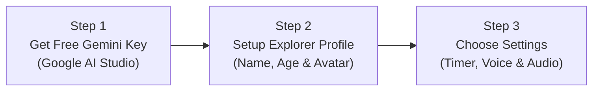

# 🚀 AstroQuest: User Quick Start Guide

Welcome to **AstroQuest**, an AI-powered cosmic learning adventure designed for young explorers (Ages 2 to 14)! This guide will walk parents, educators, and children through everything needed to get started, master the features, and make the most of every mission.

---

## 📋 Table of Contents

1. [Quick Setup in 3 Easy Steps](#1-quick-setup-in-3-easy-steps)
2. [Navigating the Cosmic Dashboard](#2-navigating-the-cosmic-dashboard)
3. [Managing Multi-Child Flight Crew Profiles](#3-managing-multi-child-flight-crew-profiles)
4. [Mastering the Quest HUD & Answering Questions](#4-mastering-the-quest-hud--answering-questions)
5. [Audio, Voice Personalities & Ambient Focus](#5-audio-voice-personalities--ambient-focus)
6. [Special Exploration Modes](#6-special-exploration-modes)
   - [⚡ Time Warp Lightning Survival Mode](#61-time-warp-lightning-survival-mode)
   - [🌌 Stellar Sky Observatory & Daily Star Habits](#62-stellar-sky-observatory--daily-star-habits)
   - [🪐 Solar System Pocket Planetarium](#63-solar-system-pocket-planetarium)
   - [👾 Mission Control Boss Question #10](#64-mission-control-boss-question-10)
7. [Learning Diagnostics & Printable Galactic Diplomas](#7-learning-diagnostics--printable-galactic-diplomas)
8. [Cross-Device Portability & Backups](#8-cross-device-portability--backups)
9. [Keyboard Shortcuts & Accessibility](#9-keyboard-shortcuts--accessibility)
10. [Frequently Asked Questions (FAQ)](#10-frequently-asked-questions-faq)

---

## 1. Quick Setup in 3 Easy Steps

AstroQuest generates 100% fresh, non-repetitive educational challenges live via Google Gemini generative AI models. Setup takes under 2 minutes:



### Step 1: Obtain a Free Google Gemini API Key

1. Visit [Google AI Studio](https://aistudio.google.com/app/apikey).
2. Sign in with any standard Google account.
3. Click **"Create API Key"** and copy your generated key string.
4. _(AstroQuest uses the free tier; no billing or credit card is required)_.

### Step 2: Configure the Explorer Profile

1. Launch AstroQuest in any modern browser (Chrome, Edge, Safari, Firefox).
2. Click **"Settings ⚙️"** in the top-right corner.
3. Enter your **Child's Name** (e.g. _"Aarav"_ or _"Diya"_).
4. Select their **Age** (Ages 2–14). The pedagogy automatically calibrates to their age level!
5. Pick an **Astronaut Avatar** (Boy, Girl, Robot, or Alien).

### Step 3: Paste and Save API Key

1. Paste your key into the **Google Gemini API Key** field.
2. Click **"Save & Launch 🚀"**. AstroQuest runs an instant live verification ping. Once verified, your key is encrypted in your browser's private storage (AES-GCM 256-bit encryption).

---

## 2. Navigating the Cosmic Dashboard

The Dashboard is mission headquarters:

```
+-------------------------------------------------------------------------------+
| 🚀 ASTROQUEST    👥 Crew: Diya (Age 8)    🏆 Level 2: Space Cadet    ⚙️ Settings |
+-------------------------------------------------------------------------------+
|  ⚡ TIME WARP SURVIVAL   |   🌌 STAR OBSERVATORY   |   🪐 POCKET PLANETARIUM  |
+-------------------------------------------------------------------------------+
|  [ Choose Your Cosmic Mission ]                                               |
|  +--------------------+  +--------------------+  +-------------------------+  |
|  | 👁️ Visual Puzzles  |  | 🧠 Analytical      |  | ➕ Add Custom Topic     |  |
|  | Patterns, 3D cubes |  | Analogies, Science |  | (e.g. Dinosaur Science)|  |
|  +--------------------+  +--------------------+  +-------------------------+  |
+-------------------------------------------------------------------------------+
```

- **Built-in Skillsets**:
  - **👁️ Visual Observation**: Pattern recognition, 3x3 matrices, spatial rotations, isometric cube stacks, and balance scales.
  - **🧠 Analytical Thinking**: Concept analogies, scientific cause-and-effect, deductive riddles, and odd-one-out classification.
- **➕ Custom Skillsets**: Click **"Add Custom Skill"** to create specialized topics (e.g., _"Dinosaurs & Fossils"_, _"Marine Biology"_, or _"Math Fractions"_). Gemini AI generates age-appropriate questions tailored to your custom subject!
- **Settings & Pacing Card**: View and adjust your timer and auto-advance pacing right from the dashboard.

---

## 3. Managing Multi-Child Flight Crew Profiles

AstroQuest supports **multiple children sharing the same computer or tablet** without mixing up their XP, badges, or grade levels:

1. Click the **"Crew 👥"** button in the top navigation bar.
2. The **Flight Crew Management** window opens.
3. Click **"Recruit New Astronaut ➕"** to add a sibling.
4. Enter their name, age, gender, and select their unique avatar.
5. To switch who is currently playing, simply click **"Switch to Cadet"** on their profile card.
6. The dashboard instantly reloads with their individual XP, astronaut rank, badges, and learning history!

---

## 4. Mastering the Quest HUD & Answering Questions

During an active quest, children solve 10 interactive questions:

```
+-------------------------------------------------------------------------------+
| [1/10]  🧑‍🚀 Aarav (Age 6)     [👁️ VISUAL]     [🔍 ZOOM]       ⏱️ 01:24 [⏸️ PAUSE] |
+------------------------------------------------------+------------------------+
|                                                      |  [A] Red Circle        |
|  What shape comes next in the pattern? 🔊            |------------------------+
|                                                      |  [B] Blue Square       |
|    [ 🔴 ]  -->  [ 🟦 ]  -->  [ 🔴 ]  -->  [ ? ]      |------------------------+
|                                                      |  [C] Green Triangle    |
|                                                      |------------------------+
|  ✨ Tap an answer choice on the right                |  [D] Yellow Star       |
+------------------------------------------------------+------------------------+
|  [⚡ 50/50 Ray]   [⏭️ SKIP]             [ ⏱️ 01:24 ]              [ SUBMIT 🚀 ] |
+-------------------------------------------------------------------------------+
```

### Answering Questions

- **Click or Tap**: Select any option card (A, B, C, D) on the right.
- **Keyboard Shortcuts**: Press keys `1`, `2`, `3`, `4` or `A`, `B`, `C`, `D` to choose an option, and `Enter` to submit.
- **Pedagogical Solution Reveal**: After submitting, the correct answer and a step-by-step cosmic explanation are revealed.
- **Auto-Advance**: The question advances automatically after your configured delay (e.g., 7 seconds), or click **"Next Question ➔"** to proceed immediately.

### Cognitive Assistance Tools

- **🔊 Read Aloud**: Tap the speaker icon next to any question to have it read aloud with glowing real-time word highlighting.
- **⚡ 50/50 Cosmic Ray**: Stuck on a tricky question? Tap the pink lightning button to blast away two incorrect choices with stardust particles!
- **🔍 Diagram Zoom**: Tap "Zoom" to view detailed geometric diagrams, prisms, or isometric block pyramids in close-up view.
- **⏭️ Skip Question**: Tap Skip if an unfamiliar challenge appears. Skipped questions can be revisited at the end of the quest without penalty!
- **⏸️ Timer Pause & Anti-Screenshot Shield**: Tap the timer to pause. The question and choices blur out to prevent screenshot cheating. Tap **"Resume Challenge"** when ready.

---

## 5. Audio, Voice Personalities & Ambient Focus

AstroQuest is designed for sensory focus and early readers:

### 🎙️ 4 Cosmic Voice Personalities

In **Settings ⚙️**, choose the guide that best fits your child's personality:

- 🌟 **Classic Explorer**: Natural, warm cadence for everyday learners.
- 🤖 **Beep-Boop Bot**: High-pitched, friendly robotic cadence that delights younger kids.
- 🚀 **Captain Nova**: Confident, energetic space commander voice.
- 🌌 **Gentle Nebula**: Soothing, relaxed storytelling pace ($0.88\times$ rate) designed to ease test anxiety.

### 🎶 Ambient Deep-Space Focus Audio

- Generates a calming 432Hz/528Hz cosmic harmonic soundscape with gentle pentatonic chimes using the browser's native Web Audio API.
- Zero audio file downloads ($0\text{ KB}$ network overhead).
- Automatically pauses when switching browser tabs to save device battery.
- Adjust volume or mute at any time in **Settings ⚙️**.

---

## 6. Special Exploration Modes

In addition to regular quests, AstroQuest includes 4 specialized game modes:

### 6.1. ⚡ Time Warp Lightning Survival Mode

- **Master Countdown**: Starts with a 60-second survival clock.
- **Mechanics**:
  - **$+5$ Seconds** bonus for every correct answer.
  - **$-3$ Seconds** penalty for incorrect choices.
  - Continuous stream of rapid-fire questions.
- **Streak Combos**: 3 correct answers in a row activates **$1.5\times$ Streak**; 5 in a row engages **$2\times$ WARP SPEED!**
- **High Scores**: Compete to beat your personal best and earn the _Time Warp Champion ⚡_ badge!

### 6.2. 🌌 Stellar Sky Observatory & Daily Star Habits

- **Map Real Constellations**: Explore real celestial constellations (_Orion_, _Ursa Major / Big Dipper_, _Cassiopeia_, _Cygnus_, _Pegasus_).
- **Daily Star Habit Loop**: Unlock star coordinates daily by completing quests or tapping "Unlock Next Star".
- **Astronomical Science**: Read mythological star lore and astronomical science facts for every star.
- **Completion Reward**: Fully mapping a constellation unlocks the _Stellar Astronomer 🌠_ badge and $+50\text{ XP}$!

### 6.3. 🪐 Solar System Pocket Planetarium

- **10 Celestial Worlds**: Tour the Sun and all 9 planets (_Mercury_, _Venus_, _Earth_, _Mars_, _Jupiter_, _Saturn_, _Uranus_, _Neptune_, _Pluto_).
- **Interactive 3D CSS Spheres**: Realistic planetary gradients, atmosphere rings for Saturn and Uranus.
- **Planet Dossier**: Learn planetary diameter, distance from the Sun in AU, surface temperature, and moon counts.
- **Audio Guides**: Tap **"Listen to Planetary Guide 🎧"** to hear spoken astronomy trivia.
- **Badge**: Explore celestial worlds to unlock the _Solar Voyager 🪐_ badge!

### 6.4. 👾 Mission Control Boss Question #10

- Question #10 in standard quests elevates into a thrilling **Super Challenge Boss Encounter**!
- The HUD transforms with a pulsing crimson and gold alert (`⚠️ BOSS ENCOUNTER ALERT`).
- Conquering the boss awards **Double XP ($+30\text{ XP}$)** and unlocks the collectible _Boss Encounter Victor 👾_ badge!

---

## 7. Learning Diagnostics & Printable Galactic Diplomas

### 📊 5-Axis SVG Cognitive Radar Chart

At the end of each quest, the **Result Overview** features a pure SVG radar chart mapping aptitude across 5 fundamental cognitive domains:

1. **Mental Arithmetic & Computation**
2. **Spatial & Visual Reasoning**
3. **Pattern Recognition & Sequences**
4. **Verbal Comprehension**
5. **Scientific Inquiry & Logic**

The chart spotlights the child's **Top Strength** (e.g., _"Spatial Reasoning Master ⭐"_), helping parents and educators celebrate specific cognitive talents.

### 🎓 Printable Galactic Explorer Certificate

- Click the prominent **"Print Galactic Diploma 🎓"** button on the results screen.
- Generates an ornamental landscape space diploma complete with:
  - Gold and cyan starlight border frame.
  - Student's name in bold title styling.
  - Official Astronaut Rank insignia.
  - Accuracy score and completed mission date.
  - Parent / Teacher signature line.
- Perfect for printing and displaying on the refrigerator or bedroom wall!

---

## 8. Cross-Device Portability & Backups

Easily transfer your child's profile, settings, and custom skillsets between devices:

- **Exporting (`Export JSON 📤`)**: Tap Export on the Dashboard or Settings page. Downloads a timestamped `.json` file (`astroquest_complete_backup_YYYY-MM-DD.json`).
- **Importing (`Import JSON 📥`)**: Tap Import on any other computer, tablet, or Chromebook. Select the backup file; all crew members, XP, ranks, and custom skillsets are immediately restored!

---

## 9. Keyboard Shortcuts & Accessibility

AstroQuest complies with **WCAG 2.1 Level AA** universal accessibility standards:

| Key                                      | Action                                                                     |
| :--------------------------------------- | :------------------------------------------------------------------------- |
| `1`, `2`, `3`, `4` or `A`, `B`, `C`, `D` | Select answer option choice                                                |
| `Enter` or `Space`                       | Submit answer / Advance to next question                                   |
| `ArrowUp` / `ArrowDown`                  | Navigate between option choices                                            |
| `ArrowLeft` / `ArrowRight`               | Step between planets in Pocket Planetarium                                 |
| `Escape`                                 | Dismiss any open modal dialog (Hint, Zoom, Observatory, Planetarium, Exit) |
| `Tab` / `Shift + Tab`                    | Accessible keyboard focus navigation with high-visibility 4px rings        |

---

## 10. Frequently Asked Questions (FAQ)

#### Q: Is the Google Gemini API free to use for AstroQuest?

**A:** Yes! Google provides a generous free tier for Google AI Studio API keys, perfectly suited for personal learning and classroom practice.

#### Q: Can two siblings use AstroQuest on the same computer?

**A:** Absolutely! Use the **"Crew 👥"** switcher in the top navigation bar. Each child gets their own profile, avatar, XP, badges, and age-calibrated questions.

#### Q: Why did the question and choices turn blurry when I paused?

**A:** AstroQuest features anti-screenshot protection while the timer is paused. This keeps challenges fair by preventing students from taking screenshots to search for answers. Simply click **"Resume Challenge"** to unblur!

#### Q: Do I need to install any apps or browser extensions?

**A:** No installation is needed. AstroQuest runs 100% inside any modern browser (Google Chrome, Microsoft Edge, Mozilla Firefox, Apple Safari) on Windows, Mac, Chromebooks, iPad, or Android tablets.

---

_Enjoy exploring the cosmos of knowledge with **AstroQuest**! 🚀⭐_
